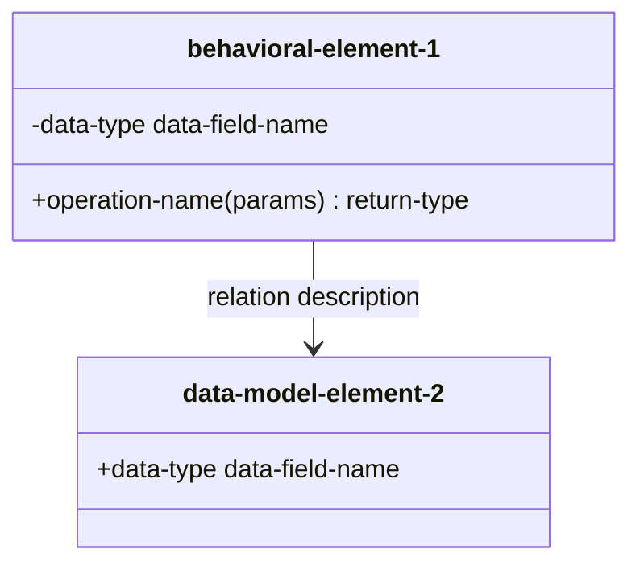

# Architecture specification format

This document specifies the form and format rules for architectural design specification files. For guidance on the actual specification content, see the `architecture-design` skill.

## Directory and file layout

```
doc/<component>/component_architecture/
  architecture.md                     index file (all other files are topic files)
  design_decisions.md                 list of all design decision
  elem_<name>.md                      static structure (elements, operations, data, class diagram)
  act_<name>.md                       activity diagram
  sm_<name>.md                        state machine diagram
  seq_<name>.md                       sequence diagram
  design_alternative_<alt-name>/      rejected alternatives, same layout as above (see also skill)
```

## Index file

`architecture.md` is the index file. It lists topic files in the following order:
- design decisions
- topic files for static structure
- topic files for dynamic behavior (activities, followed by state machines and sequences)
- design alternatives, listed by the index file of each alternative

The format is as follows:

```markdown
# Component architecture for the <Component Display Name>

<Brief overview of the component architecture.>

* [Topic name](topic-file-name.md)
```

## Topic files

A topic file consists of one or more normative fragments and is structured as follows:

```markdown
# <Topic Name>

<Optional brief overview.>

[back to index](architecture.md)

<one or more fragments>
```

A fragment is structured as follows:

````markdown
<a id="<fragment-anchor>"></a>
## ARCH: <Concise fragment name>

```yaml
id: arch:<component>-<fragment-short-name>
classification: <decision|element|operation|data|activity|statemachine|sequence>
status: draft
covers: <comma-separated list of upstream identifiers>
```

<Specification.>

> **Rationale:** <Why this fragment is needed.>

---
````

- The fragment heading is one level below its enclosing section (`##` in a flat file, `###` under a first-level section).
- The fragment ID format is `arch:<component>-<descriptive-kebab-case-id>`; characters `a-z`, `0-9`, `-` only.
- The fragment anchor equals the fragment ID with `arch:` replaced by `arch-` (ID `arch:comp-foo` -> anchor `arch-comp-foo`).
- When a fragment's terminology changes and the renamed term appears in its ID, update the ID and the anchor to match (e.g., "command" -> "message").
- `covers` references at least one existing upstream identifier (a requirement); never invent identifiers.
- The `status` of any new or modified fragment is `draft`.
- Rationale is optional. It is required only for `decision` fragments.
- Brief non-normative text may precede or sit between fragments.

## Static structure files (`elem_*.md`)

Static structure files specify the elements of the architecture, with an element being a building block with behavior (a cohesive set of operations) or, for data-model elements, a set of data fields. The files are structured as follows:

````markdown
# <Topic name>

<Brief overview>

[back to index](architecture.md)

| Element | Description | Data/Operations |
| ------- | ----------- | --------------- |
| [element-name](#element-anchor) | <responsibility> | [op-or-data-name](#op-or-data-anchor)<br> |



<element 1 fragment, describing its purpose and responsibilities>
<element 1 data fragments, describing each data field if any>
<element 1 operation fragments, describing each operation if any>
<element 2 fragment>
...
````

- Each element is specified in exactly one file.
- Order element fragments so every element appears after the elements it depends on, in both the table and the fragment body.
- Data fields precede operations of the same element, in both the table and the fragment body.
- Class label syntax must be: `class <element_diagram_name>["<element-name>"]`, where `element_diagram_name` is `element-name` with non-alphanumerics replaced by `_`.
- Element, operation, and data-field names are conceptual: lowercase, hyphen-separated (e.g., `element-operation`, `send-message`, `message-header`); do not use implementation names.
- Elements representing conceptual types, which have no data and no operations, are omitted from the class diagram, but can be used as data-field types, or operation parameter or return types.
- Elements specified in other static structure files may appear in the diagram for context when relevant.

**Operation: specification format**

````markdown
`<operation-name>(<param1>, <param2>) : <return-type>`

<Behavior observable from outside the element.>

**Parameters**:
- `<param1>`: <type and constraints>
- `<param2>`: <type and constraints>
...

**Returns**:
- `<return-value>`: <when this value or range is returned>
...
````

- The return type is a conceptual type (e.g., `boolean`, `integer`, `string`, `message`, `status code`) or another element (defined in one of the topic files).
- If an operation has no return type, omit `: <return-type>` from the signature, and write `none` in the `Returns` section.
- If an operation has no parameters, use empty brackets `()`, and write `none` in the `Parameters` section.

**Data field: specification format**

````markdown
`<field-name> : <data-type>`

<Description of the information represented by the data field.>
````

Data fields of a data-model element are public. Data fields in behavioral elements are exceptional (see skill for when they are permitted and their visibility).

## Dynamic behavior files (`act_*.md`, `sm_*.md`, `seq_*.md`)

Dynamic behavior files specify the behavior of architectural elements in more detail. Each such file contains one fragment (`activity`, `statemachine`, or `sequence`), with no rationale and with one diagram and optionally other descriptions in the specification section.

**Behavioral diagram: specification format**

````markdown
```mermaid
---
title: <title>
---
<flowchart|stateDiagram-v2|sequenceDiagram>
  ...
```

**<activity|state|transition>**: <description>
````

- A complex element operation must have an activity diagram (see skill for what counts as complex).
- An activity diagram is followed by a description of activities where their names are not self-explanatory.
- Every stateful element must have a state-machine (see skill for what counts as stateful).
- A state machine diagram is followed by a normative description of every state and transition.
- Every operation, with each distinct normal ***and** error outcomes, must appear in at least one sequence diagram.

## Cross-references between static and dynamic fragments

Use fragment anchors to cross-reference related fragments in dynamic behavior and static structure topic files as follows:
- **state machine <-> element:** the element fragment links to the state-machine fragment; the state-machine overview links back to the element fragment.
- **sequence <-> elements:** each participating element fragment links to the sequence fragment; the sequence overview links back to every participating element fragment.
- **activity <-> operation:** the operation fragment links to the activity fragment; the activity overview links back to the operation fragment.

## Mermaid diagram rules

- No `;` in note text, or in link, message, or transition labels.
- Avoid `[`, `]`, em-dash, or en-dash in note text; use parentheses or hyphens instead.
- Do not use `box` to group actors.
- Do not use `rect` for sequence separation; use a `note` over all lifelines instead.
