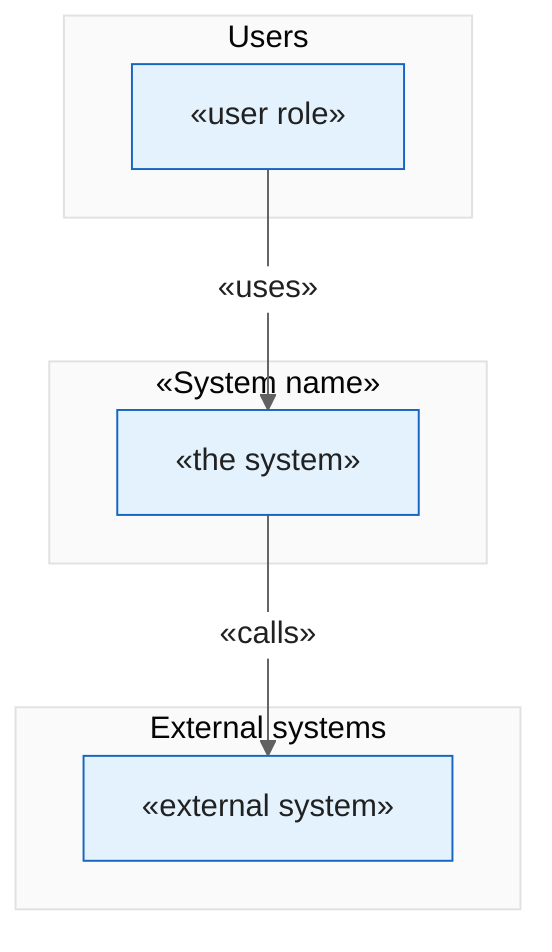
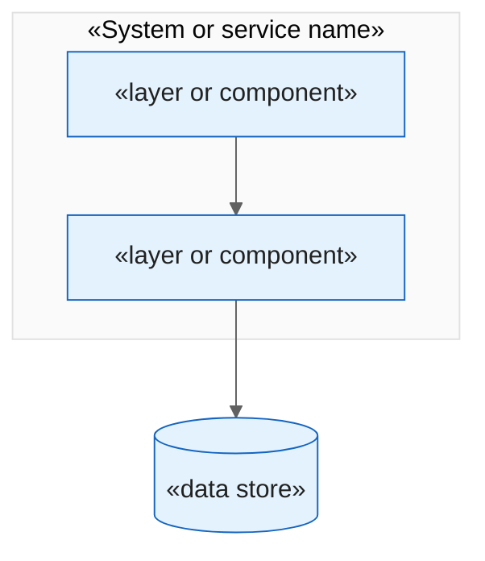
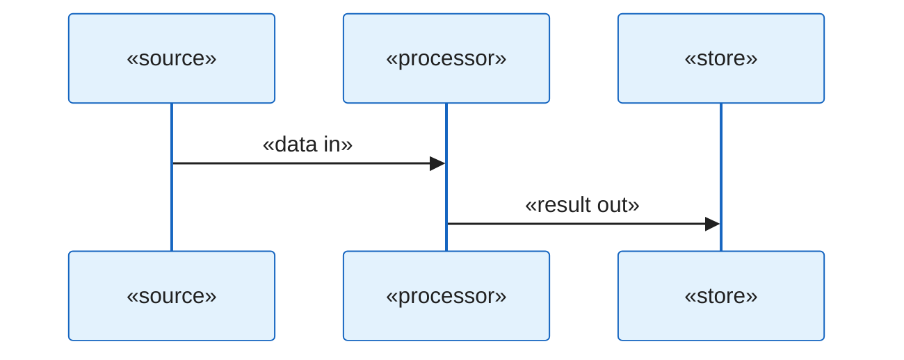
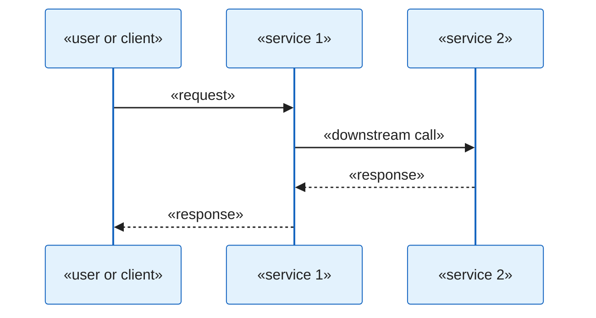
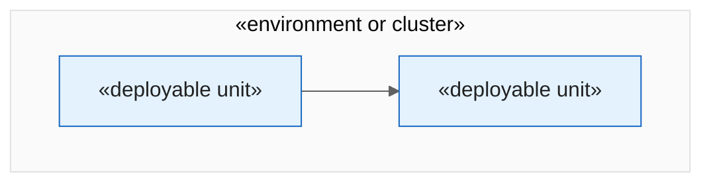

# Diagram Templates

Phase 3 of the structured-code-review workflow produces the architecture diagrams. All diagrams
are Mermaid and **must** begin with the shared theme block below, so they render consistently
and export cleanly to Word.

## Scope & limitation

These Mermaid diagrams are lightweight aids for the review deliverable. They are **not** a
replacement for the organisation's established architecture-diagramming standards and tooling,
and are not currently aligned to them. Use them to communicate the reviewer's understanding of
the system; defer to the organisation's official standards for authoritative architecture
documentation. State this caveat in the diagram section of the generated review.
<!-- TODO(PR review): name the organisation's official architecture-diagramming standard/tool. -->

## Shared theme block

Every diagram starts with this exact line:

```
%%{init: {'theme': 'base', 'themeVariables': {'primaryColor': '#e3f2fd', 'primaryTextColor': '#212121', 'primaryBorderColor': '#1565c0', 'lineColor': '#616161', 'secondaryColor': '#f5f5f5', 'tertiaryColor': '#fafafa', 'edgeLabelBackground': '#ffffff'}}}%%
```

## Adaptive diagram set

The default set is five C4-style diagrams. Produce only the ones that fit the system under
review — typically two to five. Never force an irrelevant diagram.

| Diagram | C4 level | Produce when | Skip when |
|---|---|---|---|
| System context | L1 | The system has external users and/or external systems | Rarely skipped |
| Component | L3 | The system has distinct internal modules/services | Trivially small systems |
| Key data flow | — | There is a non-obvious end-to-end data path worth tracing | Simple CRUD with no pipeline |
| Request flow | — | A user request crosses several services or layers | Libraries; single-process tools |
| Deployment | — | The system is deployed to managed infrastructure | Libraries; local-only CLI tools |

Save each diagram as its own file in `diagrams/`, e.g. `diagrams/system-context.md`. Reference
each from section 2 of `00-architecture-overview.md` with a one-line description.

## Stubs

Replace every «placeholder». Keep the theme block exactly as shown.

### System context (C4 L1)



### Component (C4 L3)



### Key data flow



### Request flow



### Deployment


